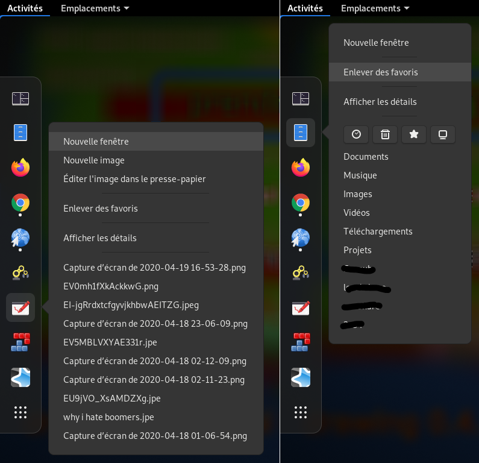

# Quicklist (GNOME Shell extension)

A [GNOME Shell extension](https://extensions.gnome.org/about/) which adds
dynamic quicklists to app icons' menu:

- file manager bookmarks (for Nautilus, Nemo, Caja or Thunar)
- recent files openable by the application

**Warning:** this is not compatible with *Dash-To-Dock* or *Ubuntu-Dock*
**thumbnail previews** (it works with *Dash to panel*, or with a dock without
thumbnail previews, or with a normal GNOME Shell dash).

Available in:
- Dutch
- French
- English
- Polish
- Croatian

## Recommenced installation

Search "Quicklists" in GNOME Software, or install it from [this website](https://extensions.gnome.org/extension/1747/quicklists/).

## Manual installation

- Clone the repository, or download its files
- Run `./install.sh`: it will move the "`quicklists@maestroschan.fr`" folder into `~/.local/share/gnome-shell/extensions/`
- You may need to restart the GNOME Shell environment (logout and login back, or <kbd>Alt</kbd> + <kbd>F2</kbd>, `r`, enter)
- Then activate it (with GNOME Tweaks, or from GNOME Software, or directly launch `gnome-shell-extension-prefs`)

<!--

## TODO

- integrate the file list into the appmenu
- with a search entry ??? in appmenu only, too heavy otherwise. For recent only, useless otherwise

- web bookmarks prefs
- web bookmarks loading

- translators au pluriel

-->

